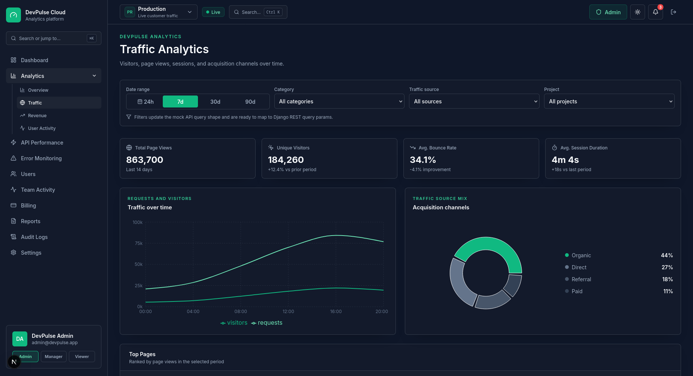
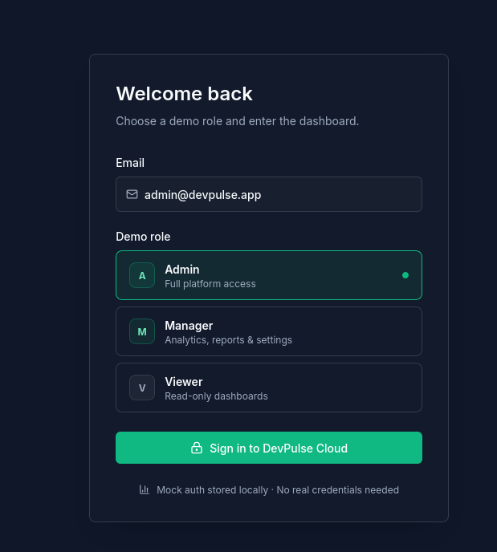
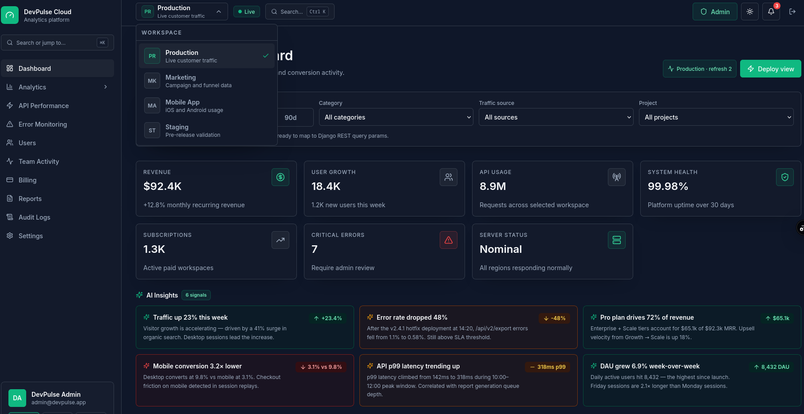
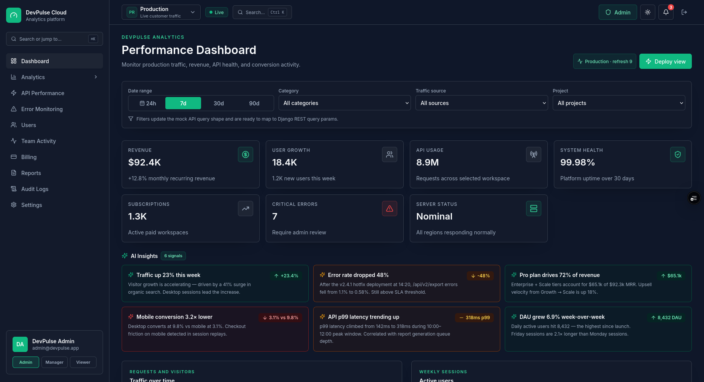
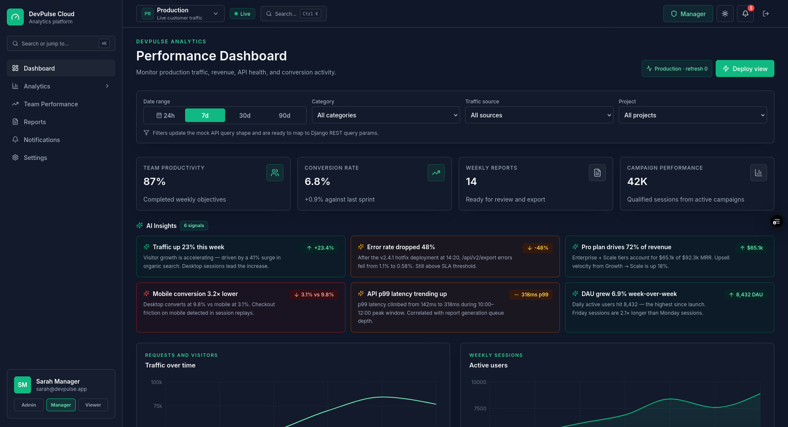
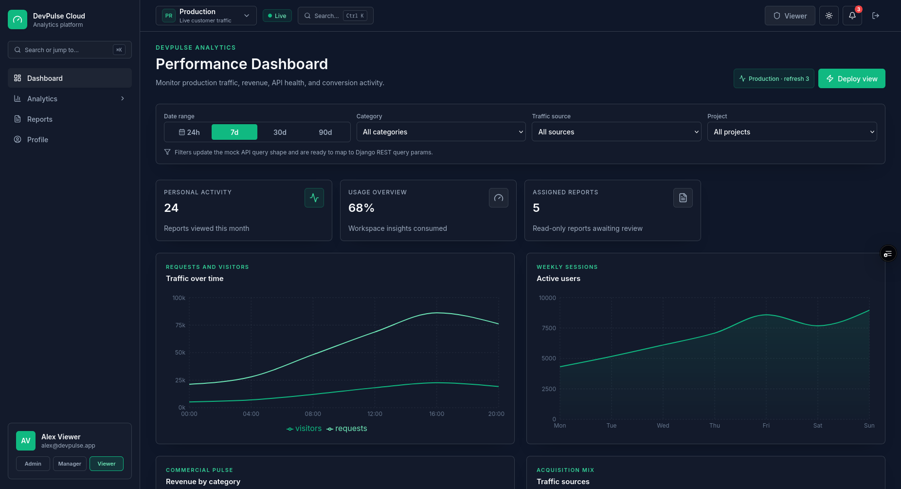

# DevPulse

DevPulse is a frontend-first SaaS analytics platform built with Next.js. It presents a polished dark-mode product surface for traffic, revenue, API reliability, reports, billing, team activity, role-based access, and workspace-level mock data.

All data is local mock data. No backend is required to run the app.



## Highlights

- Premium modern SaaS UI inspired by Linear, Vercel, Stripe, and Notion
- Role-based product experiences for `admin`, `manager`, and `viewer`
- Workspace switcher with persisted workspace selection
- Live-updating mock dashboard data
- Analytics sections for traffic, revenue, API performance, errors, and user activity
- Reports table with sorting and role-aware export controls
- Admin-only users, billing, team activity, and audit logs
- Manager-focused team performance and notifications
- Viewer read-only dashboard, reports, analytics, and profile flow
- Command palette with keyboard navigation
- Notification panel and full notifications page
- Onboarding modal for first demo login
- Dark/light theme stored in `localStorage`
- Responsive layout across desktop and mobile

## Tech Stack

- Next.js 15 App Router
- React 19
- TypeScript
- Tailwind CSS
- Recharts
- TanStack Table
- React Hook Form
- Lucide React
- `clsx` + `tailwind-merge`

## Getting Started

Install dependencies:

```bash
npm install
```

Run the development server:

```bash
npm run dev
```

Open:

```text
http://localhost:3000
```

Build for production:

```bash
npm run build
```

## Demo Access

No real credentials are required. Use the login page to choose a demo role:

- `admin`: full platform access
- `manager`: analytics, reports, notifications, settings, and team performance
- `viewer`: read-only dashboard, analytics, reports, and profile

Demo auth state is stored in `localStorage` under `devpulse-auth`.




## Workspaces

The top navbar includes a workspace switcher. The selected workspace is stored in `localStorage` under `devpulse-workspace`.

Available demo workspaces:

- Production
- Marketing
- Mobile App
- Staging

Changing workspace updates dashboard mock data, including metrics, traffic, active users, revenue charts, and role-specific widgets.




## Role-Based Experiences

### Admin

Admin navigation includes dashboard, analytics, API performance, error monitoring, users, team activity, billing, reports, audit logs, and settings.

Admin dashboard widgets include revenue, user growth, API usage, system health, subscriptions, critical errors, and server status.




### Manager

Manager navigation includes dashboard, analytics, team performance, reports, notifications, and settings.

Manager dashboard widgets include team productivity, conversion rate, weekly reports, and campaign performance.

Managers cannot access billing, user management, audit logs, or API keys.




### Viewer

Viewer navigation includes dashboard, analytics, reports, and profile.

Viewer dashboard widgets include personal activity, usage overview, and assigned reports.

Viewer reports are read-only.




## Routes

| Route | Purpose |
|---|---|
| `/login` | Demo login and role selection |
| `/dashboard` | Role-aware dashboard |
| `/analytics` | Analytics hub |
| `/analytics/traffic` | Traffic analytics |
| `/analytics/revenue` | Revenue analytics |
| `/analytics/api-performance` | Admin API performance |
| `/analytics/errors` | Admin error monitoring |
| `/analytics/user-activity` | User activity analytics |
| `/reports` | Reports table and exports |
| `/users` | Admin user management |
| `/billing` | Admin billing UI |
| `/team-activity` | Admin activity feed |
| `/audit-logs` | Admin audit log view |
| `/team-performance` | Manager performance view |
| `/notifications` | Manager notifications view |
| `/settings` | Admin and manager settings |
| `/profile` | Viewer profile |

Restricted routes render a role-aware access state instead of exposing unavailable features.

## Key Files

| File | Responsibility |
|---|---|
| `lib/auth.tsx` | Mock auth state, login/logout, role switching |
| `lib/roles.ts` | Permission utilities and role metadata |
| `lib/workspace.tsx` | Workspace state and persistence |
| `lib/data.ts` | Mock analytics datasets and live jitter helpers |
| `components/layout/app-shell.tsx` | Sidebar, top navbar, command palette, role navigation |
| `components/layout/workspace-switcher.tsx` | SaaS workspace dropdown |
| `components/layout/protected-page.tsx` | Auth and permission gate |
| `components/layout/restricted-access.tsx` | Restricted access empty state |
| `components/dashboard/dashboard-view.tsx` | Role-aware dashboard widgets and charts |
| `app/team-activity/page.tsx` | Filterable team activity feed |

## Notes

DevPulse is intentionally frontend-only for portfolio/demo use. The current mock data layer can be replaced with API fetchers later without changing the high-level UI structure.

Potential backend endpoints could include:

- `GET /api/metrics`
- `GET /api/traffic`
- `GET /api/revenue`
- `GET /api/reports`
- `GET /api/users`
- `GET /api/audit-logs`
- `GET /api/team-activity`

## Future Improvements

- Real authentication and refresh tokens
- Backend-backed RBAC
- WebSocket or server-sent live metrics
- Server-side PDF exports
- Scheduled reports
- Saved dashboards per workspace
- Alert rules for traffic spikes and error-rate anomalies
